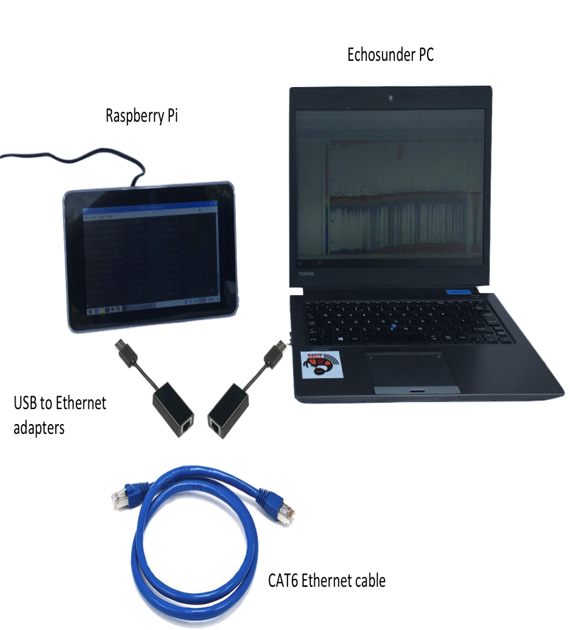

# Raspberry Pi specifics

## Introduction

RapidKrill was designed to run on small, low-power, single board
computers to faciliate large-scale, low-cost deployment on a variety
of platforms. Here we provide additional notes and instructions for
running on a Raspberry Pi 3 connected to an echosounder PC running
Windows and Simrad ER60.

## Hardware

The Raspberry Pi is connected to the echosounder PC by means of an
ethernet network We use USB to ethernet adapters in case the existing
ethernet ports are already taken. We use high-quality CAT6 Ethernet
cable for reliability. See figure below.

<p align="center"></p>

The figure shows an optional 7 inch touch screen which can be used to
present summary information but this is not essential.

## Raspbian setup

A monitor and keyboard is required to setup the Raspberry Pi at the
beginning.

Install [Raspbian](https://www.raspbian.org/), a Linux based operating
system based on Debian and optimised for the Raspberry PI following
the instructions
[here](https://www.raspberrypi.org/documentation/installation/installing-images/).

The default username is `pi`, with password `raspberry`. We recommend
that you change this for security reasons, using the `passwd` command.

## Network setup

The Ethernet network allows echosounder RAW files, stored on the
echosounder PC, to be processed by the Raspberry Pi. We use file
sharing over an Ethernet network to access the RAW files.

The Ethernet network requires configuration, and by convention, we use
the IP address `10.0.1.200` for the Raspberry Pi and `10.0.1.100` for
the echo sounder PC.

### Raspberry Pi Network

On the Raspberry Pi, use `ifconfig` to check the new ethernet adapter
name. Assuming it's `eth1` (highly likely), edit `/etc/dhcpcd.conf` to
set the address by adding these lines:

```
interface eth1
static ip_address=10.0.1.200/24
```

### Echosounder PC Network

On Windows, use the network configuration dialogue to configure the IP
Address to 10.0.1.100 with a subnet mask of 255.255.255.0. The precise
details depend on your version of Windows - See [Windows
Support](https://support.microsoft.com/en-gb/help/15089/windows-change-tcp-ip-settings)
for more information.

## Connecting to the echosounder files

Having configured the network, you can now share the echo sounder
files from the echosounder PC to the Raspberry Pi using a Windows
share.

On the echosounder PC, right click on the folder where the RAW files
are written and select share.

ON the raspberry Pi, type a command similar to the following
(replacing your own username, password, IP address and shared folder
details of the echosounder PC:

```
cd
mkdir ~/data
sudo mount -t cifs -o uid=$(id -u),gid=$(id -g),username=username,password=password, //10.0.1.100/shared /home/pi/data
```

## Python installation and setup

RapiKrill requires Python 3 along with the Python libraries detailed in the `requirements.txt` file.
It is necessary to also install some operating system dependencies, and so we also
provide a `bash` script in the install directory to install aal required python libraries along
with operating system dependencies.

```
cd install
./install-pi.sh
```

## Remote access

It can be useful to access the Raspberry Pi remotely over a network,
and this can be done using the Secure SHell porotocol (SSH). SSH is
disabled by default, but can be enabled as follows. Subsequently, you
can log in and control the Raspberry using an SSH terminal application
such as `putty` on Windows.

```
sudo systemctl enable ssh
sudo systemctl start ssh
```

## Host name

If you have more than one Raspberry Pi, it is convenient to give them
unique names.  The Raspberry Pi hostname can be changed by editing
`/etc/hosts` and `/etc/hostname` and rebooting.

## Systemd

RAPIDKRILL can also be installed using `systemd` as follows. This has
the advantage of automatically starting if the system is rebooted.

```
sudo cp rapidkrill.service /lib/systemd/system/
sudo chmod 644 /lib/systemd/system/rapidkrill.service
sudo systemctl daemon-reload
sudo systemctl enable rapidkrill.service
sudo systemctl start rapidkrill.service
```

The `rk.sh` file may need tailoring for your system.

## SendGrid

We email summary statistics from RapidKrill to land-based
systems. Sending email sounds easy, but in practice can be fraught
with difficulty, especially on a ship, (access to mail server IP ports,
blacklists, etc.) and so we use the [SendGrid](https://sendgrid.com)
Application Programming Interface instead.

Sign up for a [SendGrid](https://sendgrid.com) account (a free account
is adequate for our purposes) and [obtain an API
key](https://sendgrid.com/docs/ui/account-and-settings/api-keys/). Edit
the `rapidkrill/config.toml` file to add your key.
